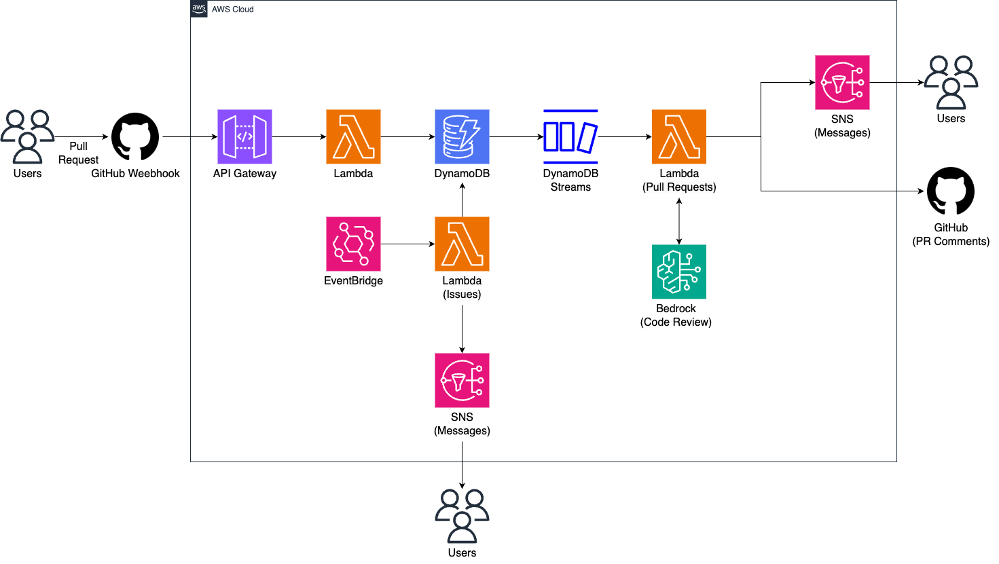

# Automated Pull Request Review & Reminder System

## Overview

Automated GitHub pull request review system that analyzes code changes,
posts LLM-generated summaries and comments, and detects long-unattended
pull requests to send automated reminders.

## Problem

- Code review turnaround time was inconsistent and heavily dependent on reviewer availability
- Some pull requests remained unattended for days, delaying releases
- Manual reminders were noisy and easy to forget

## Architecture

### Key Components

- **GitHub Webhooks**  
  Captures pull request and issue events and triggers the backend workflow.

- **Amazon API Gateway**  
  Serves as the entry point for incoming webhook events.

- **AWS Lambda (Python)**  
  Normalizes incoming webhook payloads and persists pull request and issue events into DynamoDB.

- **Amazon DynamoDB**  
  Acts as the central event store (source of truth) for pull request and issue states and metadata.

- **DynamoDB Streams (CDC)**  
  Emits change events from DynamoDB and enables asynchronous fan-out processing.

- **AWS Lambda (Python)**  
  Consumes DynamoDB Stream events to invoke Amazon Bedrock and publish notifications via SNS.

- **Amazon Bedrock**  
  Generates LLM-based pull request summaries and review comments.

- **Amazon EventBridge**  
  Periodically evaluates stale pull requests or issues and triggers reminder workflows.

- **Amazon SNS**  
  Sends automated review comments and reminder notifications to reviewers.

## Workflow

1. A pull request or issue event is received via GitHub Webhooks
2. API Gateway forwards the event to an ingestion Lambda (Python)
3. The ingestion Lambda normalizes the payload and stores it in DynamoDB (event store)
4. DynamoDB Streams (CDC) emits change records for downstream processing
5. Stream consumer Lambda(s) call Amazon Bedrock to generate summaries/comments when needed
6. Stream consumer Lambda(s) publish notifications via SNS
7. EventBridge runs scheduled checks for stale items and triggers reminder notifications via SNS

## Impact

- Accelerated pull request review cycles
- Reduced long-unattended pull requests
- Improved reviewer awareness with minimal noise

## References

- AWS Cloud Deep Dive Hands-on Guide: (link will be added)
- Demo Page: (link will be added)

> Note: Source code is not publicly available as this project was developed
> as part of an internal AWS hands-on session. This repository focuses on
> architecture, system design, and execution details.
