# Step 1 – Connecting GitHub to AWS Lambda using API Gateway

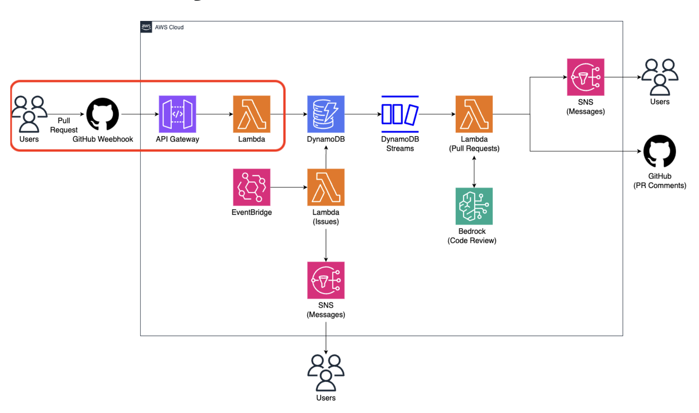
In this step, we connect GitHub Webhooks to AWS Lambda using Amazon API Gateway.
The goal is to receive GitHub Issue and Pull Request events and verify that they
are successfully delivered to AWS.

---

## Goal

- Receive GitHub Issue and Pull Request events via Webhooks
- Forward events to AWS Lambda using API Gateway
- Verify event delivery using CloudWatch Logs

---

## Prerequisites

- AWS account access
- GitHub account
- A **public GitHub repository**
- AWS Region set to **us-west-2**

> ✅ Before starting, make sure your AWS Console is set to the **us-west-2** region.

---

## Step 1. Create a Lambda Function

Create a new AWS Lambda function.

1. Go to **AWS Lambda**
2. Click **Create function**

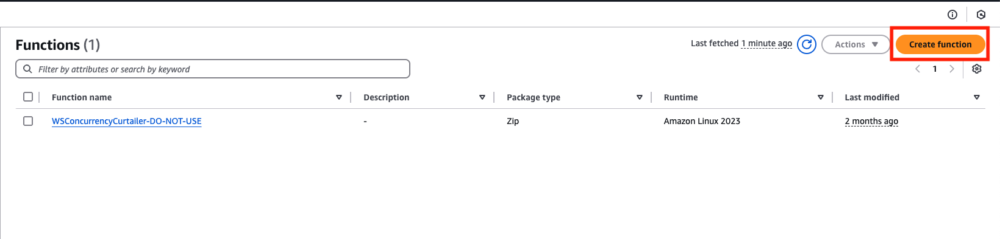

### Lambda Configuration

- **Function name**: `WebhookToDB`
- **Runtime**: Python 3.13
- **Execution role**: Default

Click **Create function**.

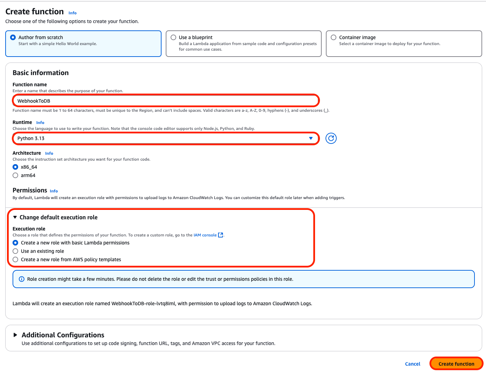

---

## Step 2. Create an API Gateway Trigger

Next, create an API Gateway endpoint and connect it to the Lambda function.

1. In the Lambda function page, add a **Trigger**
2. Select **API Gateway**

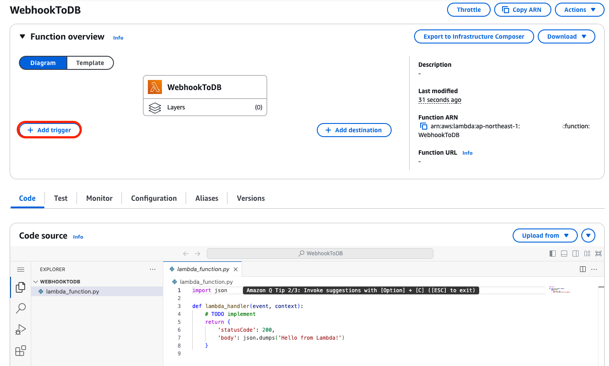
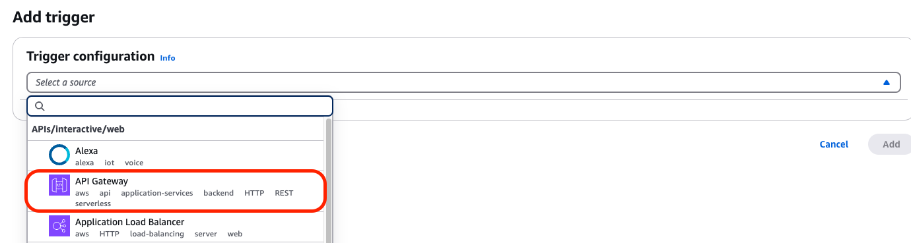

### API Gateway Settings

- Choose **Create a new API**
- Security: **Open**
- Click **Add**

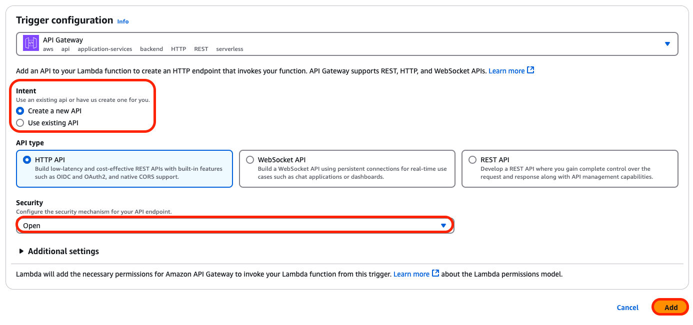

After creation, go to:

**Configuration → Triggers**

You should see a trigger named similar to `WebhookToDB-API`.

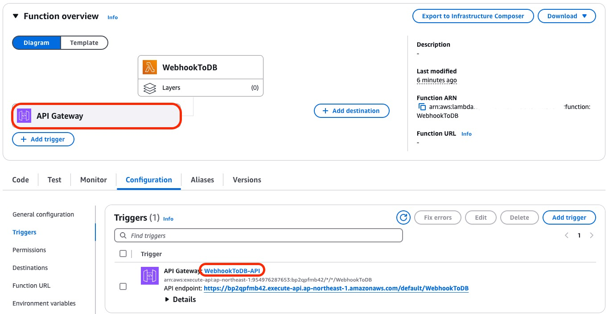

---

## Step 3. Add Logging to Lambda

To verify that GitHub webhook events are successfully delivered,
add a simple log statement to the Lambda function.

1. Return to the Lambda **Code** tab.
2. Inside the `lambda_handler` function, add the following line:

print("Event:", json.dumps(event))

This log statement is intentionally minimal.
At this stage, the goal is only to confirm that webhook events are received,
not to process or store them yet.

3. Click **Deploy** to apply the changes.

---

## Step 4. Copy the API Gateway Endpoint

After deploying the Lambda function, copy the API Gateway endpoint URL.
This endpoint will be used as the GitHub Webhook destination.

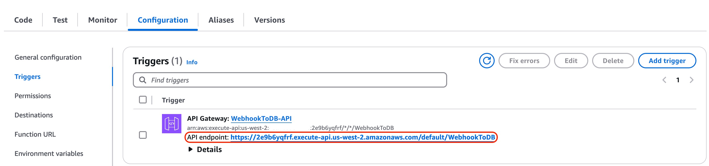

---

## Step 5. Create a GitHub Webhook

Now, create a webhook in your GitHub repository.

> Important  
> The repository must be **public**.  
> Later steps require GitHub API access for writing comments,
> which may not work properly on private repositories.

1. Go to **GitHub → Repository Settings → Webhooks**.
2. Click **Add webhook**.

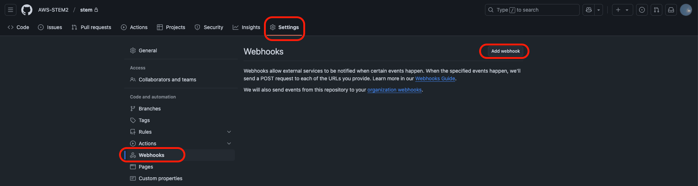

### Webhook Configuration

- **Payload URL**: Paste the API Gateway endpoint.
- **Content type**: application/json.
- Select **Let me select individual events**.

Select the following events:

- **Issues**
- **Pull requests**

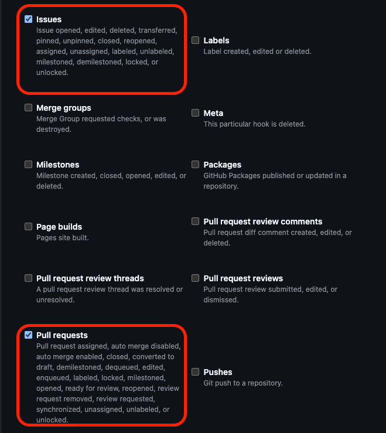

Click **Add webhook** to save.

---

## Step 6. Trigger a Test Event

To test the webhook configuration, create a new issue.

1. Go to the **Issues** tab.
2. Click **New Issue**.
3. Create an issue.

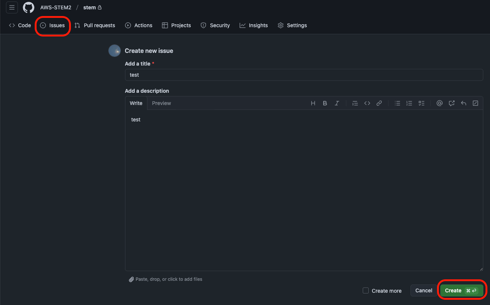

Return to the Webhooks page.
If the delivery shows a check mark, the event was sent successfully.

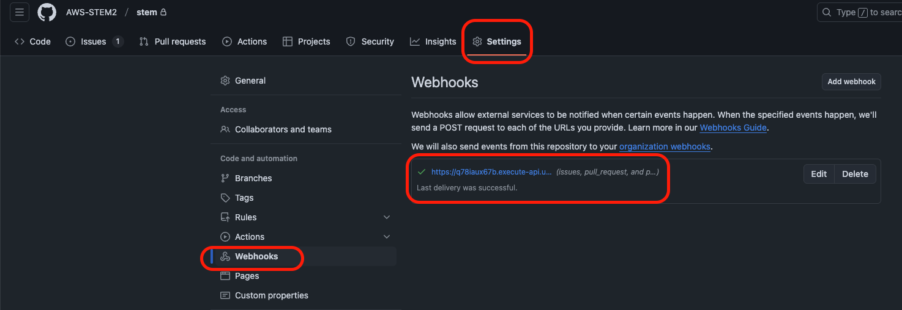

---

## Step 7. Inspect Webhook Payload (Optional)

To inspect the payload sent by GitHub:

1. Click the webhook entry.
2. Click **Recent Deliveries**.
3. Select the most recent delivery.

You should see an event payload with the `opened` action
for the newly created issue.

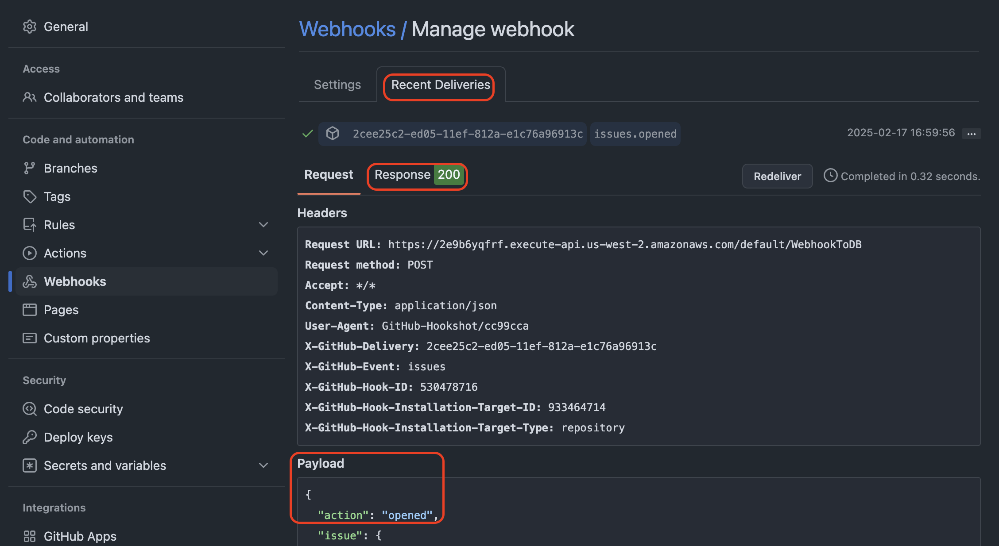

---

## Step 8. Verify Event in CloudWatch Logs

Finally, verify that AWS Lambda received the webhook event.

1. Search for **CloudWatch** in the AWS Console.
2. Go to **Log groups**.
3. Select the log group for `WebhookToDB`.

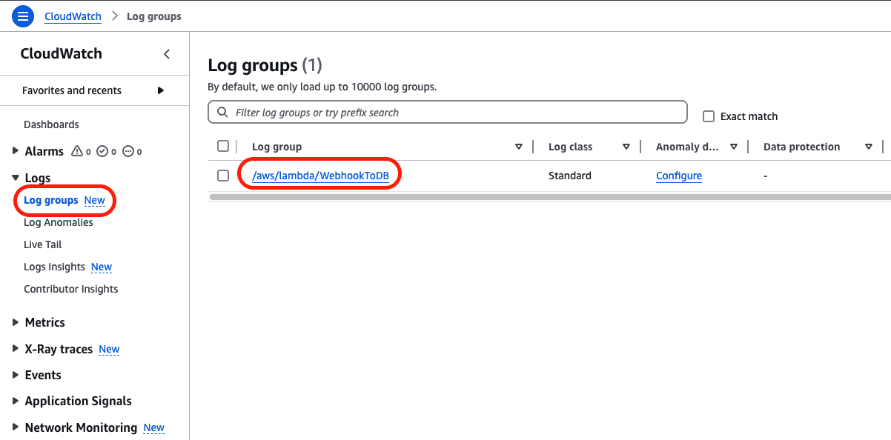

You will see two log streams:

- One created when the Lambda function was first created.
- One created when the GitHub Issue event was received.

Click the latest log stream to inspect the log output.

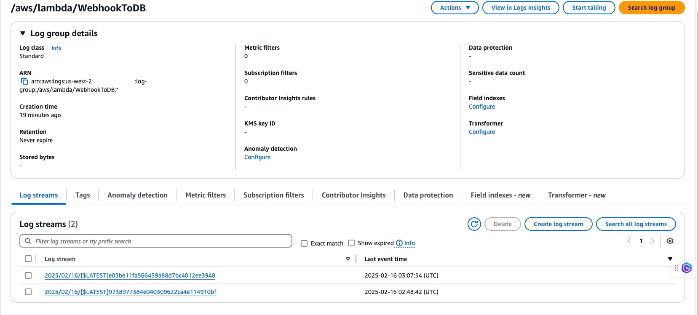

You should see the GitHub webhook payload printed in the logs.

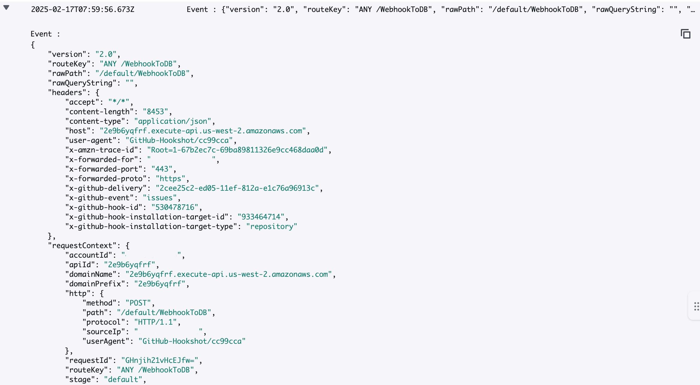

## Result

At this point:

- GitHub webhook events are successfully delivered.
- API Gateway forwards requests to AWS Lambda.
- Lambda receives and logs Issue and Pull Request events.

This completes the webhook ingestion stage and prepares the system
for event persistence using DynamoDB in the next step.
