# Step 4 – Check for Old Issues Using EventBridge-based DB Scanning

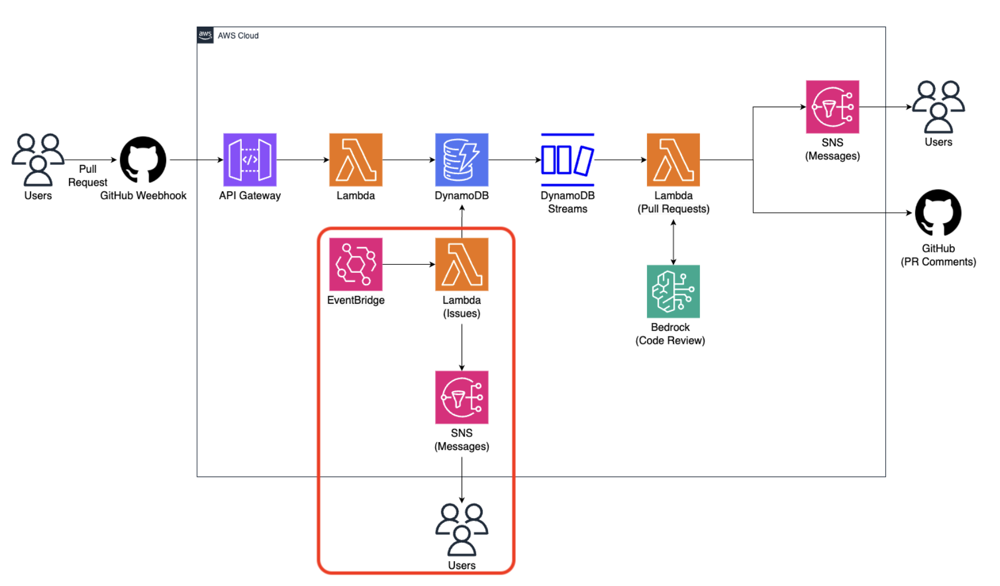

In this step, we create a scheduled Lambda function that scans DynamoDB and sends
an SMS warning if there are GitHub Issues that have been open for more than a
configured threshold (e.g., 10 minutes).

---

## Goal

- Create a Lambda function that scans DynamoDB for old Issues
- Publish an SMS notification via SNS when old Issues exist
- Create an EventBridge **Schedule** to run the scan on a fixed interval

---

## Prerequisites

- Completed **Step 2 – DynamoDB Streams**
- SNS Sandbox phone number verified (from Step 3)
- AWS Region set to **us-west-2**

> ✅ Before practicing, make sure your AWS Console is set to the **us-west-2** region.

---

## Step 1. Create a Lambda Function (CheckOldIssues)

Go to **AWS Lambda → Create function**.

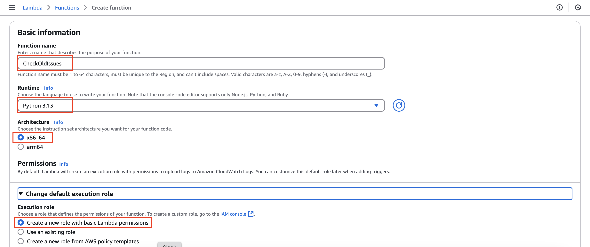

Set the following values:

- **Function name**: `CheckOldIssues`
- **Runtime**: Python 3.13

Click **Create function**.

---

## Step 2. Deploy the DynamoDB Scan Logic

Paste the provided code into the Lambda editor and click **Deploy**.

> The scan interval and threshold are configurable:
>
> - EventBridge schedule: every **5 minutes** (recommended for quick testing)
> - Old Issue threshold: **10 minutes** (can be changed in code)

Paste the code from the file below into the editor:

- [`check_old_issues.py`](../hands-on-code/step04_eventbridge/check_old_issues.py)

---

## Step 3. Grant Permissions (DynamoDB Scan + SNS Publish)

This Lambda must be able to:

- Scan DynamoDB (`dynamodb:Scan`)
- Send SMS via SNS (`sns:Publish`)

Go to **Lambda → CheckOldIssues → Configuration → Permissions**  
Click the **Role name**.

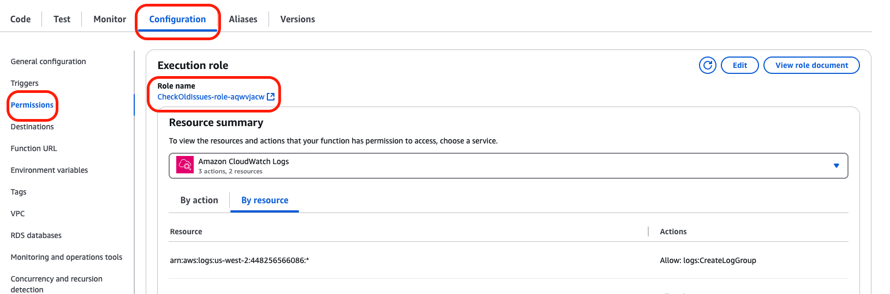

Click **Add permissions → Create inline policy**.

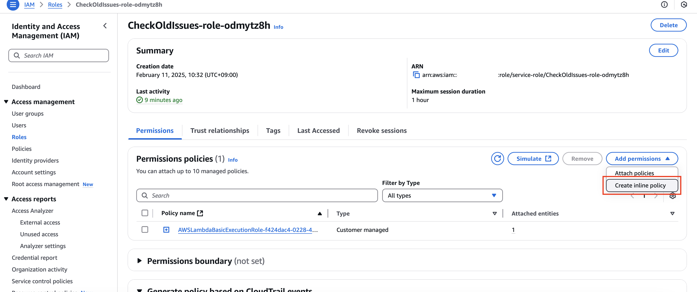

On the **Create inline policy** page, select the **JSON** tab.

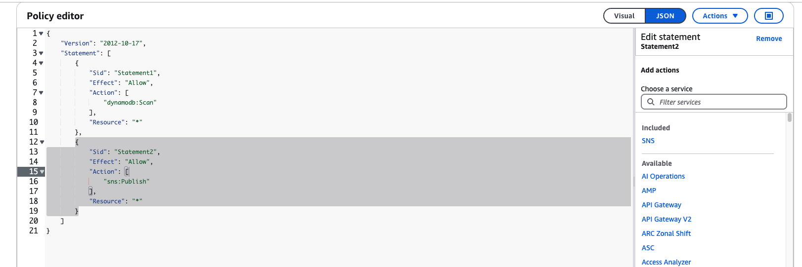

Paste the policy from the file below into the editor:

- [`lambda_dynamodb_scan_sns_publish_policy.json`](../hands-on-code/step04_eventbridge/lambda_dynamodb_scan_sns_publish_policy.json)

Click **Next**.

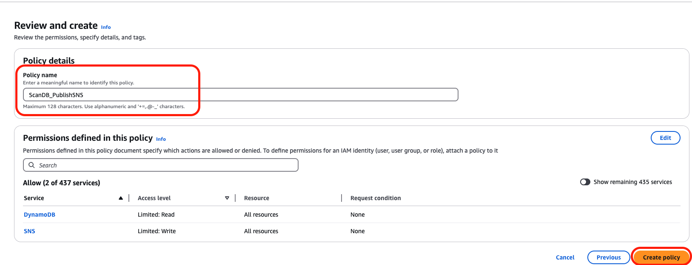

Set the policy name (example):

- `DDB_Scan_SNS_Publish`

Click **Create policy**.

---

## Step 4. Create an EventBridge Schedule

Go to **Amazon EventBridge**.

Select **EventBridge Scheduler** (Schedules) and click **Create schedule**.

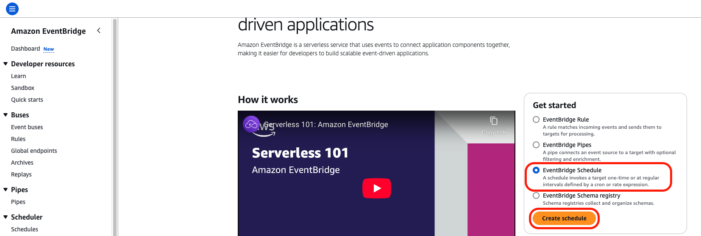

---

### Schedule Settings

Configure the schedule as follows:

- **Recurring schedule**
- **Rate-based schedule**
- **Rate expression**: `5 minutes`

This triggers the Lambda every 5 minutes.

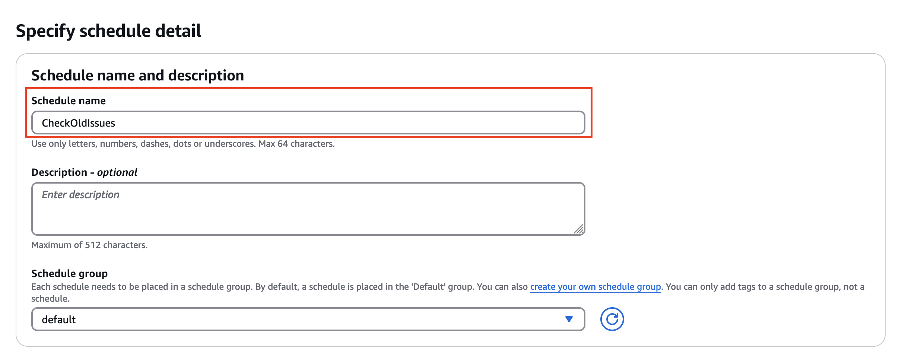
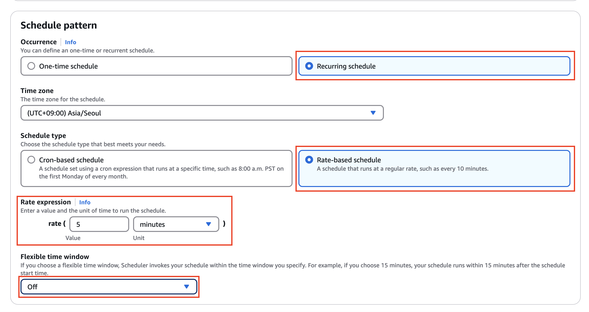

---

### Target Configuration

Set the target to the Lambda function:

- **Target type**: AWS service
- **Target**: Lambda
- **Function**: `CheckOldIssues`

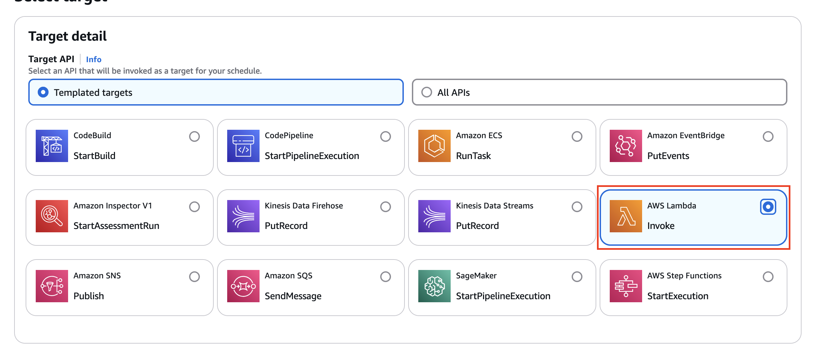
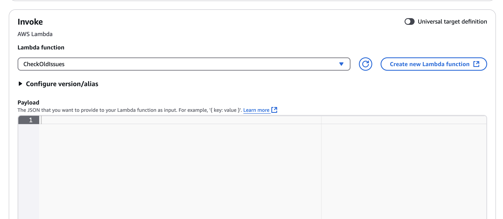

> You do **not** need to manually grant EventBridge permission to invoke Lambda.
> When you set a Lambda function as the target, the required invoke permission
> is created automatically.

Leave optional fields as default and click **Create schedule**.

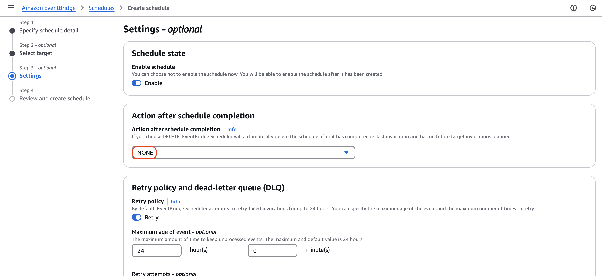
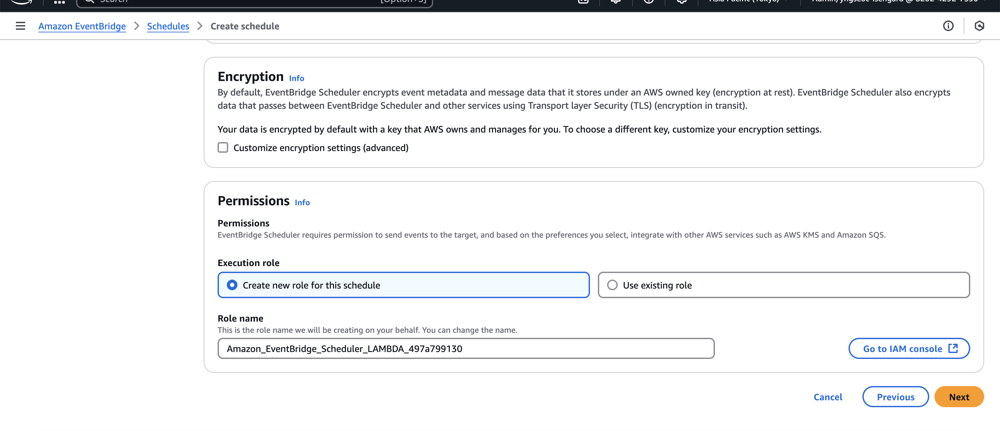

---

## Step 5. Verify DynamoDB Items (Open Issues)

Go to **DynamoDB → Explore items → GitHubEvent**  
and confirm there are currently open Issues stored in the table.

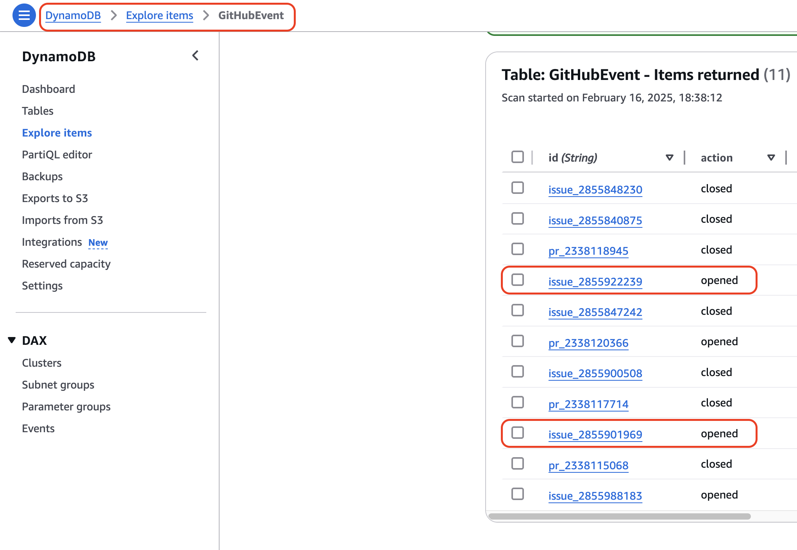

---

## Step 6. Verify SMS Notification

Wait for the schedule to run (every 5 minutes in this example).

If there is at least one Issue that is older than the threshold (10 minutes),
you should receive an SMS warning message.

---

## Result

- The `CheckOldIssues` Lambda scans DynamoDB on a schedule
- Old Issues are detected based on timestamps
- SMS notifications are sent via SNS when old Issues exist
